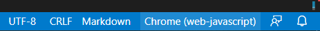
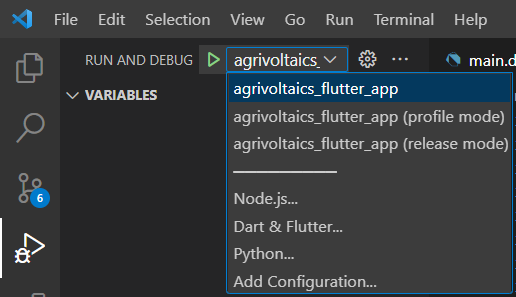
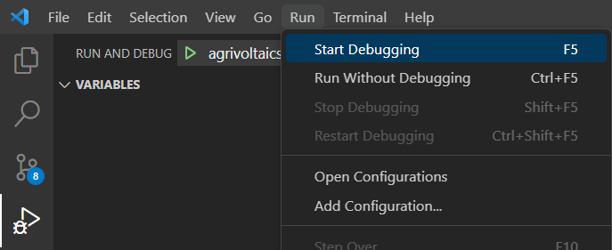

# User Documentation

## Introduction
This application is used to monitor and track local climate conditions at a given site. Currently, it is deployed alongside multiple microclimate sensor systems at an active vineyard site to monitor conditions there.

## Getting Started
Visit http://vinovoltaics.wine and log in with an authorized Google account.

## User Interface
The user interface specification can be found [here](../user-interface-specification/user-interface-specification.pdf). Below is an explanation of each functionality within the application.
### Site Selection
Select between multiple sites. A site is a geographical location. For example, one vineyard would be treated as one site.
### Date Range Selection
Select a range of time for which to display local climate data. View data over the past day, week, month, etc.
### Time Interval Selection
Select the frequency for which to display local climate data over the selected range of time. View measured data.
### Filter Selection
Filter local climate data by type of measurement (humidity, light, rainfall, etc.) and by zone (classified within the site).
### Notifications
Be alerted by the National Weather Service when local weather conditions are changing.
### Settings
Configure the timezone to show when displaying data.

### Frequently Asked Questions
-----
#### How do I add more sites to the webapp? Is there a maximum?
For the user, this is not currently supported, since it would require programming the micrcontroller to that specific site. The dev team is responsible for this. 

#### How can I add more sensors to a site location on the webapp? Is there a maximum?
For the user, this is not currently supported since it would require programming a new microcontroller to configure all of the sensor systems to work together. The dev team is responsible for this. 

#### What is the data retention period?
The data retention period is 180 days. The application will save the sensor readings for up to 180 days. 

#### What sort of notifications can I expect to recieve?
The notifications that you can expect to see included in the web application include the Weather watch Description, The time that the notification was pulled, and if it was a watch, advisory, statement or warning of the hazard. 


# Developer Documentation

## Introduction
There are multiple steps that need to be taken as a developer to fully deploy this codebase as a working application. The steps below target deployment as a web application, but this same codebase can be built and published as a mobile or desktop application with few changes.

This application operates on the assumption that an InfluxDB Cloud time-series database has been populated with real-time sensor measurement data. More information can be found [here](https://www.influxdata.com/products/influxdb-cloud/).

## Environment
This application was developed using Flutter. We recommend using Visual Studio Code as your IDE and installing the recommended Dart and Flutter extensions: https://docs.flutter.dev/get-started

## Building and Debugging
Set [this](../../../application/agrivoltaics_flutter_app/) as the root directory in Visual Studio Code to enable debugging.

In order to build and debug:
* Ensure all Flutter packages are downloaded by running ```flutter pub get```
* Populate all necessary values in [launch.json](../../../application/agrivoltaics_flutter_app/.vscode/launch.json) (see [configuration](#configuration))
* Select your target platform in the bottom right of VSCode:



* Open the Run and Debug panel, select your desired launch configuration, and select Run -> Start Debugging (F5)





Flutter will automatically build and run the application on the selected platform, outputting any build or runtime errors to the debug console.

## Configuration
| Key              | Description    |
|------------------|----------------|
| INFLUXDB_URL     |  InfluxDB Cloud instance URL (ex. https://us-east-1-1.aws.cloud2.influxdata.com)              |
| INFLUXDB_TOKEN   |  InfluxDB Cloud API token with read access to desired bucket              |
| INFLUXDB_ORG     |  InfluxDB Cloud organization (ex. 11183059442b6f41)             |
| INFLUXDB_BUCKET  |  InfluxDB Cloud instance bucket name              |
| INFLUXDB_DEBUG   |  Whether to provide debugging information on the Flutter InfluxDB client(true/false)              |
| ADMIN_EMAIL      |  Email granted access to the web application for debugging purposes              |
| OWNER_EMAIL      |  Email granted access to the web application on behalf of the client              |

## Deployment
Being written in Flutter, this application can be deployed to Android, iOS, Windows, or as a web application. The following steps are only relevant to its deployment as a web application.

### GitHub Actions
Included in this repository is a [GitHub workflow](../../../.github/workflows/deploy.yml) containing several GitHub Actions. When the ```deploy``` branch is pushed, these actions build and deploy the Flutter application as a web application on [Google Cloud Platform](#google-cloud-platform) and also build and deploy supporting Python microservices found [here](../../../application/microservices/).

### GitHub Variables & Secrets
During deployment, privileged credentials and dynamic variables present in the workflow are populated by GitHub repository variables and secrets. These can be configured on the repository level under a repository's settings.

### Google Cloud Platform
A working Google Cloud Platform environment is required in order for the above deployment to work correctly. The GCP services involved in this deployment include [Cloud Run](https://cloud.google.com/run), [Container Registry](https://cloud.google.com/container-registry), [Firebase](https://firebase.google.com/), and [Identity and Access Management](https://cloud.google.com/iam).
